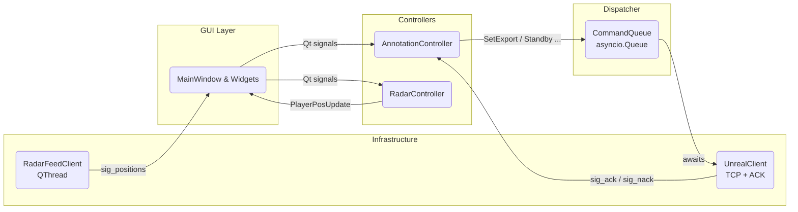

# Talos Superfly

# Player Packet (Sent >10 FPS)

| Key | Type |
| --- | --- |
| id | int [1-11] |
| x | float |
| y | float |
| influence_radius | float |

# Global Store

## PlayerAttributes

Structure sent via `p{idx}_attributes` key where `idx` is the player ID (1-11):

```py
{
    "highlight": bool,           # Whether player is highlighted
    "is_bowler": bool,          # Whether player is the bowler
    "field_position": str,      # Field position name (e.g., "Slip", "Gully")
    "player_gfx_name": str,
    "show_lable" : bool,
    "player": {                 # Player assignment (optional)
        "vendor_id": str,
        "batting_style": int,   # 0: left-handed, 1: right-handed
        "is_substitute": bool
    }
}
```

## Camera Parameters

speed: int

radius: int

height: int

## GapData

source: str  # player id ("0" for batsman in B-F-F gaps, player id string for F-F-F gaps)

fielders: list[str]  # list of 2 player ids as strings

## SuperSixData

angle: int

height: int

length: int

shot_angle: int  # in degrees

release_speed: int  # in m/s

## SuperFourData

angle: int

## FielderDistanceData

player_ids: list[int]  # [source_player_id, target_player_id] - source is 0 for batsman in B-F distances

distance: int  # distance in meters (rounded)

## CatchOutData

fielder: int  # player id

distance: int  # distance between fielder position and catch position in mtrs

## InfoLinesData

home_team: str

away_team: str

## FieldDimensions

near_end: JSON<keys>

far_end: JSON<keys>

—

**Keys:** tc, tr, wtrc, br, bc, bl, wtlc, tl

| Key | Type | Description | **Status** |
| --- | --- | --- |------------|
| p{idx}_attributes | JSON <> PlayerAttributes | Player attributes including highlight, bowler status, field position, and player assignment | Done       |
| camera_parameters | JSON <> CameraParameters | Generic camera parameters for the selected camera | Done       |
| boundary | list[pair<float, float>] | List of boundary points | Done       |
| gaps | list[GapData] | Gap visualization data (B-F-F or F-F-F) | Done       |
| highlights | list[int] | List of highlighted player ids | Done       |
| template_{template_key}_selected | bool | Refer to GFX Templates section, `Key` attribute | Done       |
| field_dimensions_highlighted | list[int] | List of highlighted field dimensions (0-7 representing 8 sectors) | Done       |
| supersixes_data | list[SuperSixData] | List of sixes data | -          |
| superfours_data | list[SuperFourData] | List of fours data | -          |
| fielder_distances_data | list[FielderDistanceData] | List of fielder distances data | Done       |
| catch_out_data | list[CatchOutData] | List of catch outs data (only sent in safe mode) | Done       |
| free_look_mode | bool | Whether to switch to free-look mode | Done       |
| free_look_camera | str | One of free-look cameras; Overrides default selected template's camera | Done       |
| home_team_id | str | Team ID of the home team | Done       |
| away_team_id | str | Team ID of the away team | Done       |
| template_team_id | str | Team ID of either home or away team; mostly used for team-specific graphic templates |            |
| header_line | str | Mostly used by all teamplates | Done       |
| description_line | str | Optional description line | Done       |
| gender | int | 0 for male; 1 for female | -          |
| near_end_name | str | Overrides default near end name | Done       |
| far_end_name | str | Overrides default far end name | Done       |
| is_test_match | bool | Whether this is a test match or not | Done       |
| bowling_arrow_visible | bool | 0 for disabled; 1 for enabled | Done       |
| influence_area_visible | bool | 0 for disabled; 1 for enabled | Done       |
| batting_sides_visible | bool | 0 for disabled; 1 for enabled | Done       |
| bowling_ends_visible | bool | 0 for disabled; 1 for enabled | Done       |
| player_ring_visible | bool | 0 for disabled; 1 for enabled | Done       |
| batting_hand | bool | 0 for right; 1 for left | Done       |
| bowling_end | bool | 0 for far end; 1 for near end | Done       |
| field_dimensions | JSON <> FieldDimensions | Field dimensions in mtrs | -          |

# Functions

| Function Name | Args | Description |
| --- | --- | --- |
| set_exports | key-value pairs | Updates the global store with provided key-value pairs |
| standby | *args  // list of template IDs | Unreal reads all the related data for the chosen template, possesses related camera and initializes base state |
| on_air | *args  // list of template IDs | Plays the related animations for the selected template |
| off_air | *args  // list of template IDs | Trigger function for Unreal to perform necessary actions to reset state |

# GFX Templates

All cameras must be auto-selected by Unreal based on the selected template. 

### Field Dimensions

**Key:** field_dimensions

**Camera:** field_dimensions_cam

**Dependent Keys:**

- selected_field_dimensions

### Super Sixes

**Key:** supersixes

**Camera:** six_cam

**Dependent Keys:**

- supersixes_data

**Note:** On multiple sixes, only height will be visible. For a single six, all provided stats (only non-null) are visible.

### Super Fours

**Key:** superfours

**Camera:** super_four_cam

**Dependent Keys:**

- superfours_data

### Fielder Distances

**Key:** fielder_distances

**Camera:** cordon

**Dependent Keys:**

- fielder_distances_data

### Catch Outs

**Key:** catch_outs

**Camera:** catch

**Dependent Keys:**

- catch_out_data

### Batsman View - Gaps

**Key:** batsman_view_gaps

**Camera:** m_batsman

**Dependent Keys:**

- gaps

### Batsman View - Highlights

**Key:** batsman_view_highlights

**Camera:** m_batsman

**Dependent Keys:**

- highlights

### Run Map

**Key:** run_map

**Camera:** run_map

### Info Line

**Key:** info_line

~~**Camera:** no_camera~~

## Payload Examples

### Highlights
```json
{
    "highlights": [1, 3, 5]  // List of player IDs that are highlighted
}
```

### Field Dimensions Highlighted
```json
{
    "field_dimensions_highlighted": [0, 2, 4]  // Sectors 0-7 (excluding sector 6)
}
```

### Fielder Distances Data
```json
{
    "fielder_distances_data": [
        {
            "player_ids": [0, 3],  // B-F distance: batsman (0) to fielder (3)
            "distance": 25
        },
        {
            "player_ids": [2, 5],  // F-F distance: fielder 2 to fielder 5
            "distance": 15
        }
    ]
}
```

### Gaps Data
```json
{
    "gaps": [
        {
            "source": "0",  // B-F-F gap: batsman as source
            "fielders": ["3", "7"]  // Two fielders
        },
        {
            "source": "2",  // F-F-F gap: fielder 2 as source
            "fielders": ["5", "9"]  // Two other fielders
        }
    ]
}
```

### Catch Out Data
```json
{
    "catch_out_data": [
        {
            "fielder": 7,  // Player ID who took the catch
            "distance": 12  // Distance fielder moved to take catch (meters)
        }
    ]
}
```

### Player Attributes
```json
{
    "p3_attributes": {
        "is_bowler": true,
        "show_label": true,
        "field_position": "third_man",
        "player_vendor_id": "123",
        "player_gfx_name": "Smith"
    }
}
```

## Unreal TCP Contract

**Base URL:** `tcp://localhost:6969`

### Request Format:

```json
{
    "request_id": str, // <uuid.UUID>,
    "function": "set_exports",
    "arguments": {
        "key1": value,
        "key2": value
    }
}
```

### Response Format:

```json
{
    "status_code": int, // 200 (ok) or 400 (bad request) or 500 (unreal error),
    "status_message": str,  // only to be sent if `status_code` is 400 or 500
    "request_id": str,
}
```

## Talos Superfly GUI - Mental Model


